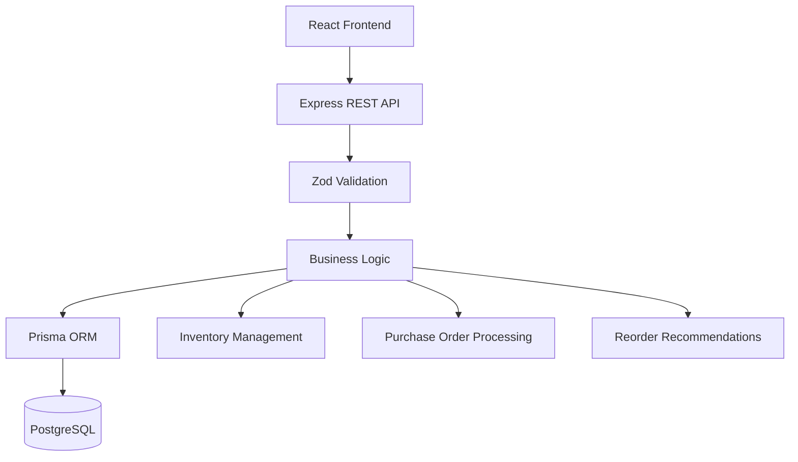
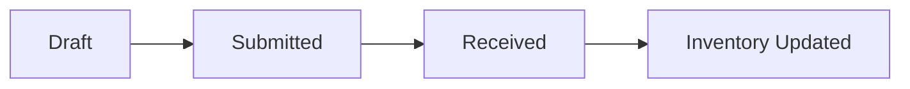

# ClinicOps System Architecture

```mermaid
flowchart TD
    A[React Frontend] --> B[Express REST API]
    B --> C[Zod Validation]
    C --> D[Business Logic]
    D --> E[Prisma ORM]
    E --> F[(PostgreSQL)]

    D --> G[Inventory Management]
    D --> H[Purchase Order Processing]
    D --> I[Reorder Recommendations]
```

## Purchase Order Lifecycle

```mermaid
flowchart LR
    A[Draft] --> B[Submitted]
    B --> C[Received]
    C --> D[Inventory Updated]
```

Receiving an order uses a database transaction to ensure that order status and stock quantities are updated together.